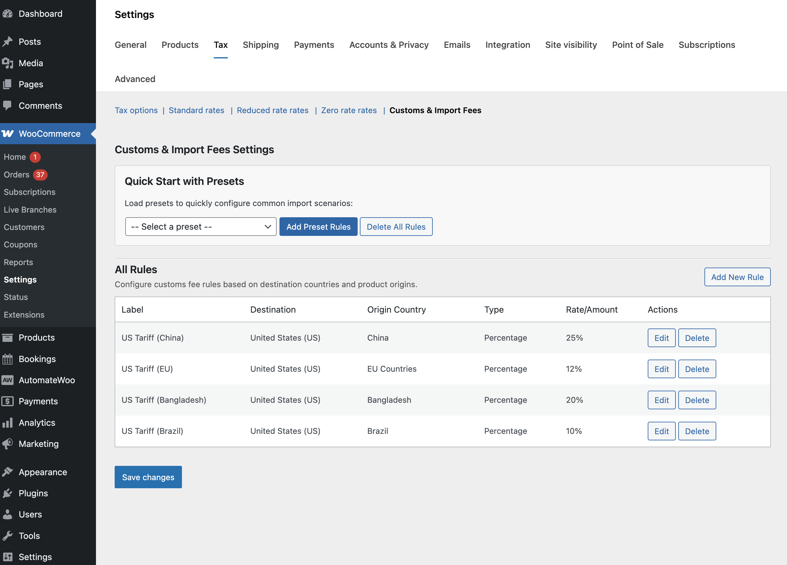
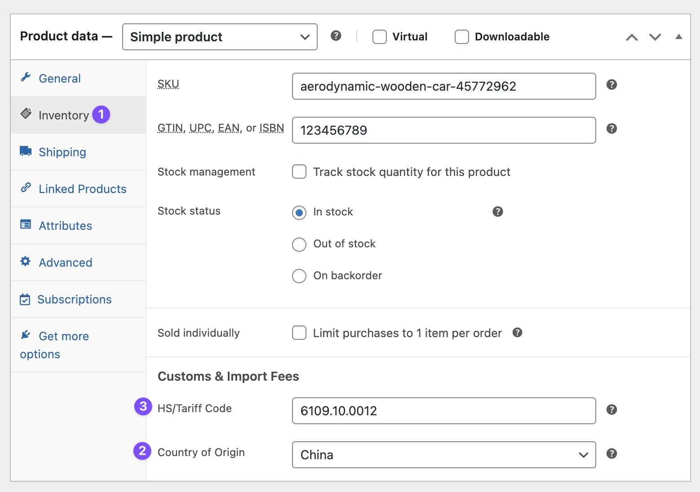
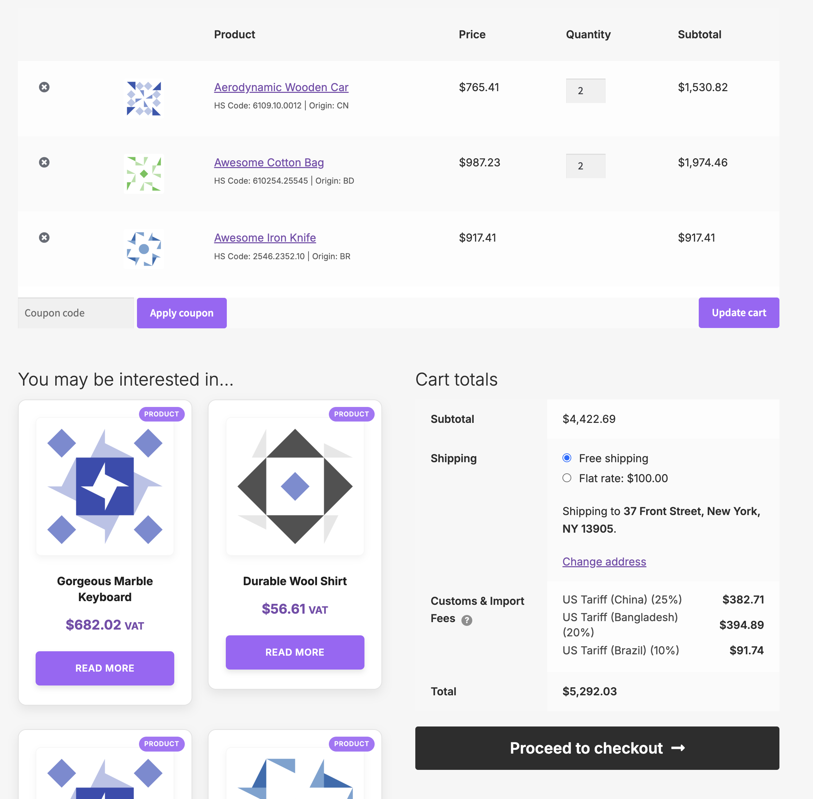
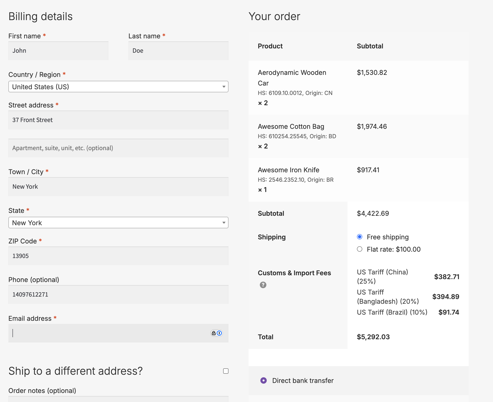
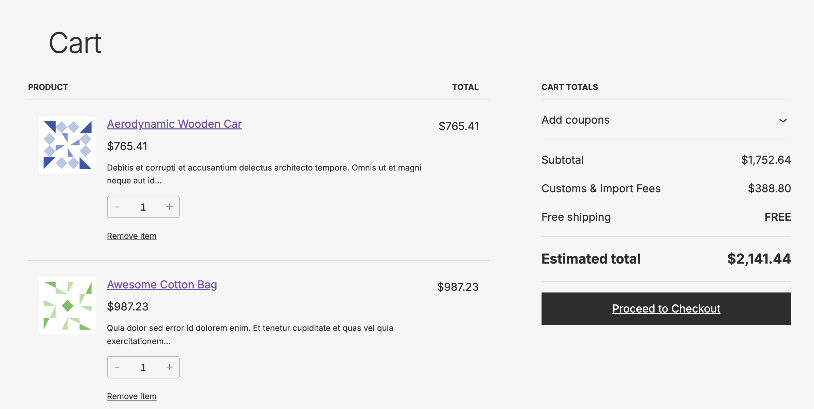
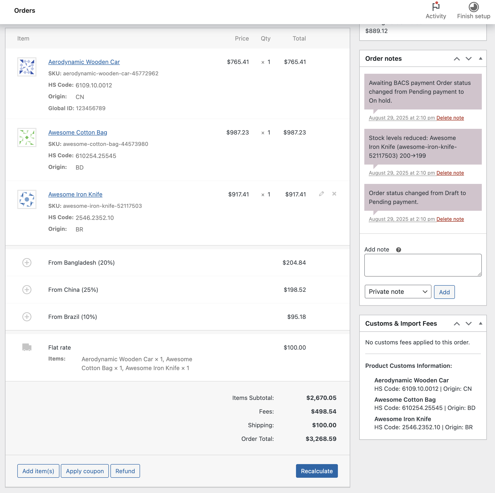

# Customs Fees for WooCommerce

Add automated customs fees and import duties to your WooCommerce store. This plugin calculates and displays customs fees based on destination countries and product origins, helping international merchants provide transparent pricing to their customers.

## Purpose

With the U.S. ending its de minimis exemption on **August 29, 2025**, all international shipments will require customs duties regardless of value. This plugin helps merchants:

- **Add transparency** to international orders.
- **Prevent cart abandonment** from surprise fees.
- **Build customer trust** with upfront total costs.
- **Stay compliant** with new regulations.

## Features

- **Automated Fee Calculation**: Calculate customs fees based on percentage or flat rates.
- **Origin-Based Rules**: Set different fees based on product origin countries.
- **Smart Presets**: Quick setup with built-in presets for US, UK, EU, Canada, and Australia tariffs.
- **Product-Level Settings**: Define origin country and HS codes for individual products.
- **CSV Import/Export**: Bulk update product HS codes and countries of origin using WooCommerce's CSV tools (ID or SKU required for updates).
- **Transparent Checkout**: Display detailed fee breakdown to customers.
- **Flexible Rules**: Create unlimited custom rules for any country combination.
- **HPOS Compatible**: Fully compatible with WooCommerce High-Performance Order Storage.

## Installation

1. Upload the plugin files to `/wp-content/plugins/customs-fees-for-woocommerce/`.
2. Activate the plugin through the 'Plugins' menu in WordPress.
3. Navigate to **WooCommerce > Settings > Customs Fees** to configure.

## Quick Start Guide

### Step 1: Enable Customs Fees

1. Go to **WooCommerce > Settings > Tax > Customs & Import Fees**
2. Configure Fee Rules.

You have two options to set up your fee rules:

#### Option A: Use Presets (Recommended for Quick Setup)

1. In the Customs Fees settings, find the "Quick Start with Presets" section.
2. Select a preset from the dropdown (e.g., "US Tariffs - General Import").
3. Click "Add Preset Rules" to load the preset.
4. Click "Save changes" to apply.

Available presets include:

- US Tariffs (General, EU, China, Canada, Mexico, Japan, etc.)
- UK Import VAT and Duties.
- Canadian GST and Import Duties.
- Australian GST and Import Duties.
- EU Common Customs Tariff.

#### Option B: Create Custom Rules

1. Click "Add New Rule" button at the top right
2. Fill in the rule details:
   - **Label**: Name for the fee (e.g., "Import Duty from China").
   - **Destination**: Country where the product is being shipped to.
   - **Origin**: Country where the product is from (or "All Origins").
   - **Type**: Choose between Percentage or Flat fee.
   - **Rate/Amount**: Enter the fee value.
3. Click "Save" to add the rule.
4. Click "Save changes" to persist all rules.

### Step 2: Set Product Origins

For accurate fee calculation, set the origin country for your products:

1. Edit any product in your store.
2. Go to the **Product Data > Inventory** tab.
3. Find the **"Customs & Import Information"** section.
4. Select the **Country of Origin** from the dropdown.
5. Optionally add an **HS Code** for customs classification.
6. Update the product.

### Step 3: Test Your Setup

1. Add a product with a configured origin country to your cart.
2. Go to the cart or checkout page.
3. You should see "Customs & Import Fees" listed with the calculated amount.
4. The breakdown shows all applied rules with radio indicators. (Currently support only classic cart and checkout.)








## How It Works

The plugin calculates customs fees based on:

1. **Customer's shipping country** (destination).
2. **Product's origin country** (configured per product).
3. **Matching rules** you've configured.

When a customer adds products to their cart, the plugin:

- Checks each product's origin country.
- Finds matching rules based on destination and origin.
- Calculates fees (percentage of product price or flat amount).
- Displays the total customs fees at checkout.

## Managing Rules

### Adding Rules

- Click "Add New Rule" to create a new fee rule.
- Use presets for quick setup of common scenarios.

### Editing Rules

- Click "Edit" next to any rule to modify it.
- Changes require clicking "Save changes" to persist.

### Deleting Rules

- Click "Delete" next to a rule (confirm by clicking again).
- Use "Delete All Rules" to clear all rules at once.

## Configuration Tips

### For US Stores

1. Use the US Tariff presets as a starting point.
2. Customize rates based on your specific product categories.
3. Set accurate origin countries for all products.

### For EU Stores

1. Use the EU Common Customs Tariff preset.
2. Configure VAT rules for imports from outside EU.
3. Consider adding country-specific rules for major trading partners.

### For Global Stores

1. Create rules for your main destination countries.
2. Use "All Origins" for general import duties.
3. Add specific origin rules for preferential rates.

## Display Options

The plugin automatically groups all customs fees under a single "Customs & Import Fees" heading on cart and checkout pages. Individual rules are displayed as a breakdown with radio indicators for clarity.

## Troubleshooting

### Fees Not Showing

1. Ensure customs fees are enabled in settings.
2. Check that you have active rules configured.
3. Verify products have origin countries set.
4. Confirm rules match the shipping destination.
5. Verify product is not virutal or digital.

### Incorrect Calculations

1. Review your rule configurations.
2. Check for overlapping rules (more specific rules take precedence).
3. Verify percentage vs flat fee settings.

### Product Origin Not Saving

1. Ensure WooCommerce is up to date.
2. Check for theme/plugin conflicts.
3. Verify proper permissions for product editing.

## Developer Information

### Hooks and Filters

The plugin provides several hooks for customization:

```
// Modify calculated fees
add_filter('cfwc_calculated_fee', 'my_custom_fee_calculation', 10, 4);

// Add custom fee rules
add_filter('cfwc_fee_rules', 'my_custom_rules', 10, 2);

// Customize fee display
add_filter('cfwc_fee_label', 'my_custom_label', 10, 3);
```

### Database Structure

Rules are stored as a JSON array in the `cfwc_rules` option. Each rule contains:

- `label`: Display name.
- `country`: Destination country code.
- `origin_country`: Origin country code or special values (EU, '').
- `type`: 'percentage' or 'flat'.
- `rate`: Percentage rate (if type is percentage).
- `amount`: Flat amount (if type is flat).

## Requirements

- WordPress 6.0 or higher.
- WooCommerce 9.0 or higher.
- PHP 7.4 or higher.

## Support

For support, feature requests, or bug reports, please create an issue.

## Changelog

### Version 1.0.0

- Initial release.
- Core customs fee calculation functionality.
- Product origin country settings.
- Preset templates for major countries.
- HPOS compatibility.
- Grouped fee display on checkout.

## License

This plugin is licensed under the GPL v2 or later.

---

**Note**: This plugin calculates estimated customs fees for display purposes. Actual customs fees may vary based on current regulations, product classifications, and other factors. Always verify with official customs authorities for accurate fee information.
