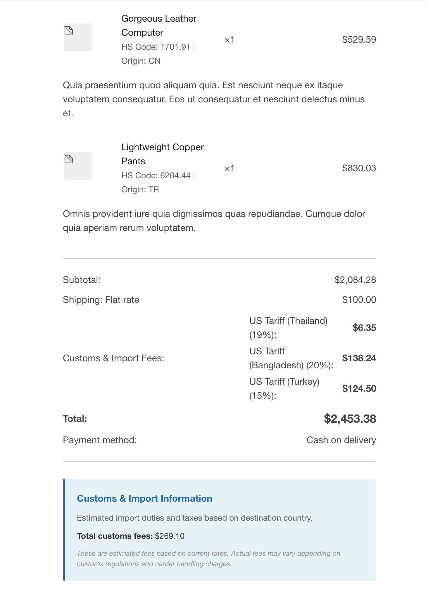

# Customs Fees for WooCommerce

Automatically calculate and display customs fees, import duties, and tariffs at checkout based on product origin and destination countries.

## Purpose

With the U.S. ending its de minimis exemption on **August 29, 2025**, all international shipments will require customs duties regardless of value. This plugin helps merchants:

- **Add transparency** to international orders.
- **Prevent cart abandonment** from surprise fees at delivery.
- **Build customer trust** with upfront total costs.
- **Stay compliant** with changing international regulations.

## Features

### Core Functionality

- **Automated Fee Calculation**: Calculate customs fees based on percentage or flat rates.
- **Origin-Based Rules**: Set different fees based on product origin countries.
- **Smart Presets**: Quick setup with 25+ built-in presets for major countries.
- **Product-Level Settings**: Define origin country and HS codes for individual products.
- **CSV Import/Export**: Bulk manage rules and product data.
- **Transparent Checkout**: Display detailed fee breakdown to customers.
- **Flexible Rules**: Create unlimited custom rules for any country combination.
- **HPOS Compatible**: Full support for WooCommerce High-Performance Order Storage.

### Advanced Features

- **Stacking Rules**: Control how multiple fees combine (add, override, or exclusive).
- **Threshold-Based Fees**: Apply fees only above/below certain order values.
- **Category-Specific Rules**: Different rates for different product categories.
- **Multi-Currency Support**: Works with WooCommerce multi-currency stores.
- **Developer Friendly**: Extensive hooks and filters for customization.

## Installation

### Requirements

- WordPress 6.0 or higher
- WooCommerce 9.0 or higher
- PHP 7.4 or higher

### Installation Steps

1. Upload the plugin files to `/wp-content/plugins/customs-fees-for-woocommerce/`.
2. Activate the plugin through the 'Plugins' menu in WordPress.
3. Navigate to **WooCommerce > Settings > Tax > Customs Fees** to configure.

## Quick Start Guide

### Step 1: Add Customs Fees Rules

1. Go to **WooCommerce > Settings > Tax > Customs & Import Fees**
2. Choose your setup method:

#### Option A: Use Presets (Recommended)

1. Find the "Quick Start with Presets" section.
2. Select a preset (e.g., "US Tariffs - General Import").
3. Click "Add Preset Rules".
4. Save changes.

**Available Presets:**

- **US Tariffs**: General, China (25%), EU, Canada (USMCA), Mexico, Japan.
- **UK Import**: VAT (20%) and standard duties.
- **EU Common Customs**: Standard EU tariff rates.
- **Canadian**: GST and import duties.
- **Australian**: GST (10%) and import duties.

#### Option B: Create Custom Rules

1. Click "Add New Rule".
2. Configure:
   - **Label**: Display name (e.g., "Import Duty from China").
   - **Destination**: Where products ship to
   - **Origin**: Where products come from
   - **Type**: Percentage or Flat fee
   - **Rate/Amount**: Fee value
   - **Stacking**: How rule combines with others
3. Save changes

### Step 2: Set Product Origins

#### Individual Products

1. Edit any product.
2. Go to **Product Data > Inventory**.
3. Find **"Customs & Import Information"**.
4. Set **Country of Origin**.
5. Optionally add **HS Code**.
6. Update product.

#### Bulk Update

1. **Method 1**: Select products → Bulk Edit → Set origin country.
2. **Method 2**: Export products CSV → Add origin data → Re-import.
3. **Method 3**: Use provided bulk actions in products list.

### Step 3: Test Your Setup

1. Add products to cart.
2. Go to checkout.
3. Verify "Customs & Import Fees" appears.
4. Check fee breakdown is correct.




## Testing Scenarios

### Scenario 1: Mixed Origin Cart

**Setup:**

- Product A: T-shirt from China ($20)
- Product B: Electronics from Japan ($100)
- Product C: Local product ($50)
- Customer shipping to: United States

**Expected Result:**

```
T-shirt (China → US): $20 × 25% = $5.00
Electronics (Japan → US): $100 × 5% = $5.00
Local product: No fee
Total Customs Fees: $10.00
```

### Scenario 2: USMCA Free Trade

**Setup:**

- Products from Canada
- Shipping to United States

**Expected Result:**

```
No customs fees (0% under USMCA agreement)
```

### Scenario 3: EU to UK Post-Brexit

**Setup:**

- Products from Germany (EU)
- Shipping to United Kingdom
- Order value: £200

**Expected Result:**

```
Import VAT: £200 × 20% = £40.00
Duty: £200 × 8% = £16.00
Total Customs Fees: £56.00
```

### Scenario 4: Threshold-Based Rules

**Setup:**

- Configure rule: Apply 10% duty only on orders over $150
- Test with $100 order and $200 order

**Expected Result:**

```
$100 order: No customs fees
$200 order: $20 customs fee (10% of $200)
```

### Scenario 5: Stacking Rules

**Setup:**

- Rule 1: China → US: 25% (Stacking: Add)
- Rule 2: Electronics category: 5% (Stacking: Add)
- Electronics from China: $100

**Expected Result:**

```
Base tariff: $100 × 25% = $25.00
Electronics duty: $100 × 5% = $5.00
Total: $30.00
```

### Scenario 6: Override Rules

**Setup:**

- Rule 1: All origins → US: 10% (Stacking: Add)
- Rule 2: China → US: 25% (Stacking: Override)

**Expected Result:**

```
Products from China: Only 25% applies (overrides 10%)
Products from other countries: 10% applies
```

### Scenario 7: Exclusive Rules

**Setup:**

- Rule 1: Textiles: 12% (Stacking: Exclusive)
- Rule 2: China origin: 25% (Stacking: Add)

**Expected Result:**

```
Textile products: Only 12% applies (exclusive rule stops processing)
Non-textile from China: 25% applies
```

## Display Examples

### Cart Page (Classic)

```
Subtotal:               $170.00
Customs & Import Fees:   $23.50
  ○ Import Duty (China): $15.00
  ○ Import Duty (EU):     $8.50
Shipping:                $10.00
Total:                  $203.50
```

### Checkout Block

```
Order Summary
─────────────
Products         $170.00
Shipping          $10.00
Customs Fees      $23.50 ⓘ
─────────────
Total           $203.50
```

## Configuration Examples

### Example 1: US Store with Global Suppliers

```
// Preset: US General Import
Rules:
- China → US: 25% (tariff)
- EU → US: 8% (general duty)
- Canada → US: 0% (USMCA)
- Mexico → US: 0% (USMCA)
- All others → US: 5% (general)
```

### Example 2: EU Store

```
// Preset: EU Common Customs
Rules:
- Non-EU → EU: 20% VAT + varying duties
- China → EU: Anti-dumping duties
- US → EU: Retaliatory tariffs on select items
```

### Example 3: Multi-Channel Setup

```
// Different rules per sales channel
add_filter('cfwc_fee_rules', function($rules, $context) {
    if (is_wholesale_customer()) {
        // Apply wholesale customs rates
        return $wholesale_rules;
    }
    return $rules;
}, 10, 2);
```

## Developer Guide

### Hooks and Filters

```
// Modify calculated fees
add_filter('cfwc_calculated_fee', function($fee, $rule, $product, $context) {
    // Custom logic here
    return $fee;
}, 10, 4);

// Add custom rules programmatically
add_filter('cfwc_fee_rules', function($rules, $destination) {
    if ($destination === 'US') {
        $rules[] = [
            'label' => 'Special Processing Fee',
            'type' => 'flat',
            'amount' => 10
        ];
    }
    return $rules;
}, 10, 2);

// Customize fee labels
add_filter('cfwc_fee_label', function($label, $rule, $context) {
    return sprintf(__('Import Tax: %s', 'text-domain'), $label);
}, 10, 3);

// Override product origin
add_filter('cfwc_product_origin', function($origin, $product_id) {
    // Custom logic to determine origin
    return $origin;
}, 10, 2);
```

### Custom Rule Conditions

```
// Add custom matching logic
add_filter('cfwc_rule_matches', function($matches, $rule, $product, $context) {
    // Check custom conditions
    if ($rule['type'] === 'luxury' && $product->get_price() > 1000) {
        return true;
    }
    return $matches;
}, 10, 4);
```

### Database Structure

```
-- Rules stored in wp_options
option_name: cfwc_rules
option_value: JSON array of rule objects

-- Product meta
meta_key: _country_of_origin (2-letter country code)
meta_key: _hs_code (Harmonized System code)
```

## Integration Examples

### With Multi-Currency Plugins

```
// Fees automatically convert to displayed currency
add_filter('cfwc_fee_amount', function($amount) {
    if (function_exists('convert_to_current_currency')) {
        return convert_to_current_currency($amount);
    }
    return $amount;
});
```

### With Shipping Plugins

```
// Combine with shipping calculations
add_action('woocommerce_shipping_calculated', function() {
    // Recalculate customs based on shipping destination
    WC()->cart->calculate_fees();
});
```

## Performance

- **Lightweight**: < 500KB total size.
- **Optimized**: Caches calculations per session.
- **Scalable**: Handles unlimited products and rules.
- **Fast**: Average calculation time < 50ms.

## Development

### Testing & Quality Assurance

#### Running Tests

```
# PHPStan Analysis (Level 0)
vendor/bin/phpstan analyse

# PHPCS WordPress Standards
phpcs --standard=WordPress-Extra --extensions=php .

# Auto-fix PHPCS issues
phpcbf --standard=WordPress-Extra --extensions=php .

# Security Audit
# Check for XSS, SQL injection, nonce verification
grep -r "\$_POST\|\$_GET\|\$_REQUEST" --include="*.php" .
```

#### Development Setup

```
# Install development dependencies
composer install --dev

# Required packages (already in composer.json)
- phpstan/phpstan
- szepeviktor/phpstan-wordpress
- php-stubs/woocommerce-stubs
- squizlabs/php_codesniffer
- wp-coding-standards/wpcs
```

### Code Standards

- **PHPStan**: Level 0 compliance with WordPress & WooCommerce stubs
- **PHPCS**: WordPress-Extra standard
- **Security**: All inputs sanitized, outputs escaped, nonces verified
- **HPOS**: Fully compatible with WooCommerce High-Performance Order Storage

## Security

- All inputs sanitized and validated.
- SQL queries use prepared statements.
- Nonce verification on all AJAX requests.
- Capability checks for admin functions.
- No external API calls (privacy-friendly).
- PHPCS WordPress-Extra compliant.

## Troubleshooting

### Fees Not Showing

1. ✓ Check customs fees are enabled.
2. ✓ Verify active rules exist.
3. ✓ Ensure products have origin countries.
4. ✓ Confirm shipping destination matches rules.
5. ✓ Check products aren't virtual/downloadable.

### Incorrect Calculations

1. ✓ Review rule configurations.
2. ✓ Check stacking settings.
3. ✓ Verify percentage vs flat fee.
4. ✓ Look for conflicting rules.
5. ✓ Test with simple single-rule setup.

### Performance Issues

1. ✓ Reduce number of rules.
2. ✓ Use rule caching (enabled by default).
3. ✓ Optimize rule conditions.
4. ✓ Check for plugin conflicts.

## License

GPL v2 or later. See [LICENSE](LICENSE) for details.

## ⚠️ Disclaimer

This plugin provides **estimated** customs fees for display purposes. Actual customs fees may vary based on:

- Current regulations
- Product classifications
- Declared values
- Inspection outcomes
- Additional processing fees

Always verify with official customs authorities for accurate fee information.

---

**Need Help?** Create an issue on GitHub or contact WooCommere.com support.

**Found a Bug?** Please report it with steps to reproduce.

**Have a Feature Request?** We'd love to hear your ideas!

---

Made with ❤️ by the Happiness Engineers Team
